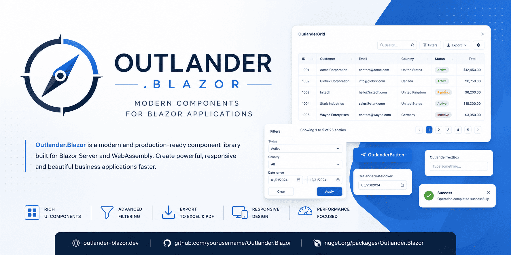

<p align="center">
  
</p>

<h1 align="center">Outlander.Blazor</h1>

<h2 align="center">
  Build Business Applications Faster with Blazor
</h2>

Outlander.Blazor is a modern component library for Blazor applications focused on productivity, performance, and enterprise scenarios.

The project provides reusable UI components designed to simplify the development of business applications such as ERP, CRM, POS, reporting systems, dashboards, and internal management platforms.

---

## Features

### OutlanderGrid

The first component included in the library is a powerful data grid with support for:

- Server-side and client-side data binding
- Sorting
- Filtering
- Global search
- Row selection
- Column customization
- Footer summaries
- Excel export
- PDF export
- Responsive design
- Bootstrap 5 integration
- Blazor Server support
- Blazor WebAssembly support

---

## Installation

Install the package from NuGet:

```bash
dotnet add package Outlander.Blazor
```

---

## Registration

Add the namespace to your `_Imports.razor`:

```razor
@using Outlander.Blazor
```

If required by future components:

```csharp
builder.Services.AddOutlander();
```

---

## Example

<h4 class="">Custom Columns</h4>

```razor
<AppGrid TItem="ServerItem"
            Items="@ServersB"
            RowClick="OnRowClick"
            RowDoubleClick="OnRowDoubleClick"
            AllowSort="true"
            AllowHotTrackRow="true"
            AllowFocusedRow="true"
            @bind-FocusedRow="@FocusedServerB"
            @bind-SelectedItems="@SelectedServersB"
            ShowSearchBox="true"
            SearchBoxNullText="Buscar en todas las columnas..."
            SearchBoxText=""
            ShowExportButtons="true"
            ExcelExportMode="AppGridExportMode.Data"
            PdfExportMode="AppGridExportMode.Data"
            PrintExportMode="AppGridExportMode.Data"
            ExportFileName="servidores"
            ExportTitle="Listado de servidores"
            SearchBoxParseMode="GridSearchTextParseMode.GroupWordsByAnd"
            PageSize="@PageSize"
            PageSizeChanged="OnPageSizeChanged"
            ShowColumnChooser="true"
            EmptyText="No se encontraron servidores.">
    <ToolbarTemplate>
        <div class="d-flex align-items-center gap-2 flex-wrap justify-content-end">
            <button class="btn btn-primary"
                    data-bs-toggle="modal"
                    data-bs-target="#importServersModal"
                    disabled="@(SelectedServers.Count == 0)">
                <i class="bi bi-download me-2"></i>
                <span>Importar @SelectedServers.Count seleccionados</span>
            </button>
        </div>
    </ToolbarTemplate>
    <Columns>
        <AppGridSelectionColumn TItem="ServerItem"
                                Width="48px"
                                AllowSelectAllItems="true" />

        <AppGridDataColumn TItem="ServerItem"
                            FieldName="Name"
                            Caption="Nombre"
                            AllowFilter="true"
                            AllowSort="true"
                            SortMode="GridColumnSortMode.DisplayText"
                            SortOrder="GridColumnSortOrder.Ascending"
                            SortIndex="1"
                            SortTextSelector="item => item.Name"
                            FilterTextSelector="item => item.Name">
            <FilterTemplate Context="filter">
                <input class="form-control form-control-sm"
                        placeholder="Filtrar nombre..."
                        value="@filter.Value"
                        @oninput="e => filter.SetValue(e.Value?.ToString())" />
            </FilterTemplate>
            <CellTemplate Context="cell">
                <div class="name-cell">
                    @cell.Highlight(cell.Item.Name)
                    @if (cell.Item.IsNew)
                    {
                        <span class="bg-danger bg-opacity-10 text-danger border border-danger-subtle px-2 py-1 small rounded-pill ms-2">NUEVO</span>
                    }
                </div>
            </CellTemplate>
        </AppGridDataColumn>

        <AppGridDataColumn TItem="ServerItem"
                            FieldName="Provider"
                            Caption="Proveedor"
                            AllowFilter="true"
                            AllowSort="true"
                            SortMode="GridColumnSortMode.DisplayText"
                            SortTextSelector="item => item.Provider"
                            FilterTextSelector="item => item.Provider">
            <FilterTemplate Context="filter">
                <select class="form-select form-select-sm"
                        value="@filter.Value"
                        @onchange="e => filter.SetValue(e.Value?.ToString())">
                    <option value="">Todos</option>
                    <option value="VMware">VMware</option>
                    <option value="Alibaba">Alibaba</option>
                </select>
            </FilterTemplate>
            <CellTemplate Context="cell">
                <div class="provider-cell">
                    <span class="provider-mini @cell.Item.BootStrapIcon">@cell.Item.Abreviature</span>
                    <span>@cell.Highlight(cell.Item.Provider)</span>
                </div>
            </CellTemplate>
        </AppGridDataColumn>

        <AppGridDataColumn TItem="ServerItem"
                            FieldName="Status"
                            Caption="Estado"
                            AllowFilter="true"
                            AllowSort="true"
                            SortMode="GridColumnSortMode.DisplayText"
                            SortTextSelector="item => item.Status"
                            FilterTextSelector="item => item.Status">
            <FilterTemplate Context="filter">
                <select class="form-select form-select-sm"
                        value="@filter.Value"
                        @onchange="e => filter.SetValue(e.Value?.ToString())">
                    <option value="">Todos</option>
                    <option value="Running">Running</option>
                    <option value="Powered Off">Powered Off</option>
                </select>
            </FilterTemplate>
            <CellTemplate Context="cell">
                <div class="status-cell">
                    <span class="status-dot @(cell.Item.Status == "Running" ? "status-green" : "status-orange")"></span>
                    <span>@cell.Highlight(cell.Item.Status)</span>
                </div>
            </CellTemplate>
        </AppGridDataColumn>

        <AppGridDataColumn TItem="ServerItem"
                            FieldName="Ip"
                            Caption="IP"
                            AllowFilter="true"
                            AllowSort="true"
                            FilterTextSelector="item => item.Ip">
            <FilterTemplate Context="filter">
                <input class="form-control form-control-sm"
                        placeholder="IP..."
                        value="@filter.Value"
                        @oninput="e => filter.SetValue(e.Value?.ToString())" />
            </FilterTemplate>
        </AppGridDataColumn>

        <AppGridDataColumn TItem="ServerItem"
                            FieldName="Cluster"
                            Caption="Cluster / Recurso"
                            AllowFilter="true"
                            AllowSort="true"
                            SortMode="GridColumnSortMode.DisplayText"
                            SortTextSelector="item => item.Cluster"
                            FilterTextSelector="item => item.Cluster">
            <FilterTemplate Context="filter">
                <input class="form-control form-control-sm"
                        placeholder="Cluster..."
                        value="@filter.Value"
                        @oninput="e => filter.SetValue(e.Value?.ToString())" />
            </FilterTemplate>
        </AppGridDataColumn>

        <AppGridDataColumn TItem="ServerItem"
                            FieldName="OperatingSystem"
                            Caption="Sistema Operativo"
                            AllowFilter="true"
                            AllowSort="true"
                            SortMode="GridColumnSortMode.DisplayText"
                            SortTextSelector='item => $"{item.Provider}-({item.OperatingSystem})"'
                            FilterTextSelector='item => $"{item.Provider}-({item.OperatingSystem})"'>
            <FilterTemplate Context="filter">
                <input class="form-control form-control-sm"
                        placeholder="SO..."
                        value="@filter.Value"
                        @oninput="e => filter.SetValue(e.Value?.ToString())" />
            </FilterTemplate>
            <CellTemplate Context="cell">
                <div class="status-cell">
                    <span class="fw-bold">@cell.Highlight(cell.Item.Provider + "-")</span>
                    <span>@cell.Highlight(cell.Item.OperatingSystem)</span>
                </div>
            </CellTemplate>
        </AppGridDataColumn>

        <AppGridDataColumn TItem="ServerItem"
                            FieldName="_registered"
                            Caption="Ya registrado"
                            AllowFilter="false"
                            AllowSort="false"
                            FilterTextSelector='item => "No"'>
            <CellTemplate Context="cell">
                <span class="bg-danger bg-opacity-10 border border-danger-subtle fw-normal px-2 py-1 rounded small text-danger">
                    @cell.Highlight("No")
                </span>
            </CellTemplate>
        </AppGridDataColumn>

        <AppGridDataColumn TItem="ServerItem"
                            FieldName="_actions"
                            Caption="Acción"
                            AllowFilter="false"
                            AllowSort="false"
                            AllowExport="false"
                            Width="90px">
            <CellTemplate Context="cell">
                <button class="btn btn-default btn-default-sm outlander-grid-export-ignore">
                    <i class="bi bi-download"></i>
                </button>
            </CellTemplate>
        </AppGridDataColumn>
    </Columns>
</AppGrid>
```

<h4 class="">Automatic Columns</h4>

```razor
<AppGrid TItem="ServerItem"
            Items="@ServersA"
            RowClick="OnRowClick"
            RowDoubleClick="OnRowDoubleClick"
            AllowSort="true"
            AllowHotTrackRow="true"
            AllowFocusedRow="true"
            @bind-FocusedRow="@FocusedServerA"
            @bind-SelectedItems="@SelectedServersA"
            ShowFilterRow="true"
            ShowExportButtons="true"
            PageSize="@PageSize"
            PageSizeChanged="OnPageSizeChanged"
            EmptyText="No se encontraron servidores.">

    <Settings>
        <AppGridSearchSettings TItem="ServerItem"
                                Show="true"
                                NullText="Buscar..."
                                Text="centos"
                                ParseMode="GridSearchTextParseMode.GroupWordsByAnd" />
    </Settings>

    <Columns>
        <AppGridSelectionColumn TItem="ServerItem"
                                Width="48px"
                                AllowSelectAllItems="true">
        </AppGridSelectionColumn>

        <AppGridDataColumn TItem="ServerItem"
                            FieldName="Name"
                            Caption="Nombre"
                            AllowFilter="true"
                            AllowSort="true"
                            SortMode="GridColumnSortMode.DisplayText"
                            SortOrder="GridColumnSortOrder.Ascending"
                            SortIndex="1" />

        <AppGridDataColumn TItem="ServerItem"
                            FieldName="Provider"
                            Caption="Proveedor"
                            AllowFilter="true"
                            AllowSort="true"
                            Visible="false"
                            SortMode="GridColumnSortMode.DisplayText" />

        <AppGridDataColumn TItem="ServerItem"
                            FieldName="Status"
                            Caption="Estado"
                            AllowFilter="true"
                            AllowSort="true"
                            SortMode="GridColumnSortMode.DisplayText" />

        <AppGridDataColumn TItem="ServerItem"
                            FieldName="Ip"
                            Caption="IP"
                            AllowFilter="true"
                            AllowSort="true" />

        <AppGridDataColumn TItem="ServerItem"
                            FieldName="Cluster"
                            Caption="Cluster / Recurso"
                            AllowFilter="true"
                            AllowSort="true"
                            SortMode="GridColumnSortMode.DisplayText" />

        <AppGridDataColumn TItem="ServerItem"
                            FieldName="OperatingSystem"
                            Caption="Sistema Operativo"
                            AllowFilter="true"
                            AllowSort="true"
                            SortMode="GridColumnSortMode.DisplayText"
                            FilterMode="GridFilterMode.Range" />

        <AppGridDataColumn TItem="ServerItem"
                            FieldName="IsNew"
                            Caption="Registrado"
                            AllowFilter="true"
                            AllowSort="true" />

        <AppGridDataColumn TItem="ServerItem"
                            FieldName="MemoryGb"
                            Caption="Memoria (GB)"
                            AllowFilter="true"
                            AllowSort="true"
                            FilterMode="GridFilterMode.Range" />

        <AppGridDataColumn TItem="ServerItem"
                            FieldName="CreatedAt"
                            Caption="Fecha de alta"
                            AllowFilter="true"
                            AllowSort="true"
                            FilterMode="GridFilterMode.Range" />
    </Columns>
</AppGrid>
```

---

## Example Model

```csharp
public class ServerItem
    {
        public string Name { get; set; } = string.Empty;
        public string Provider { get; set; } = string.Empty;
        public string Status { get; set; } = string.Empty;
        public string Ip { get; set; } = string.Empty;
        public string Cluster { get; set; } = string.Empty;
        public string OperatingSystem { get; set; } = string.Empty;
        public string BootStrapIcon { get; set; } = string.Empty;
        public string Abreviature { get; set; } = string.Empty;
        public bool IsNew { get; set; }
        public bool Selected { get; set; }
        public DateTime CreatedAt { get; set; }
        public decimal MemoryGb { get; set; }
    }

    private List<ServerItem> ServersA = new()
    {
        new() { Name = "vm-prod-01", Provider = "VMware", Status = "Running", Ip = "10.10.10.10", Cluster = "Cluster-Prod", OperatingSystem = "Ubuntu 22.04", IsNew = true, Selected = true, BootStrapIcon = "provider-badge-primary", Abreviature = "vm", CreatedAt = new DateTime(2026, 05, 29), MemoryGb = 16 },
        new() { Name = "vm-prod-01", Provider = "VMware", Status = "Running", Ip = "10.10.10.10", Cluster = "Cluster-Prod", OperatingSystem = "Ubuntu 22.04", IsNew = true, Selected = true, BootStrapIcon = "provider-badge-primary", Abreviature = "vm", CreatedAt = new DateTime(2026, 04, 29), MemoryGb = 20 },
        new() { Name = "vm-db0-01", Provider = "Alibaba", Status = "Running", Ip = "10.10.10.11", Cluster = "Clúster-Prod", OperatingSystem = "RHEL 8.6", IsNew = true, Selected = true, BootStrapIcon = "provider-badge-orange", Abreviature = "a", CreatedAt = new DateTime(2026, 06, 29), MemoryGb = 16 },
        new() { Name = "vm-db0-01", Provider = "Alibaba", Status = "Running", Ip = "10.10.10.11", Cluster = "Cluster-Prod", OperatingSystem = "RHEL 8.6", IsNew = true, Selected = true, BootStrapIcon = "provider-badge-orange", Abreviature = "a", CreatedAt = new DateTime(2026, 05, 9), MemoryGb = 16 },
        new() { Name = "vm-prod-01", Provider = "VMware", Status = "Running", Ip = "10.10.10.10", Cluster = "Cluster-Prod", OperatingSystem = "Ubuntu 22.04", IsNew = true, Selected = true, BootStrapIcon = "provider-badge-primary", Abreviature = "vm", CreatedAt = new DateTime(2025, 05, 29), MemoryGb = 32 },
        new() { Name = "vm-prod-01", Provider = "VMware", Status = "Running", Ip = "10.10.10.10", Cluster = "Cluster-Prod", OperatingSystem = "Ubuntu 22.04", IsNew = true, Selected = true, BootStrapIcon = "provider-badge-primary", Abreviature = "vm", CreatedAt = new DateTime(2024, 05, 29), MemoryGb = 64 },
        new() { Name = "vm-db0-01", Provider = "Alibaba", Status = "Running", Ip = "10.10.10.11", Cluster = "Cluster-Prod", OperatingSystem = "RHEL 8.6", IsNew = true, Selected = true, BootStrapIcon = "provider-badge-orange", Abreviature = "a", CreatedAt = new DateTime(2026, 07, 29), MemoryGb = 128 },
        new() { Name = "vm-db0-01", Provider = "Alibaba", Status = "Running", Ip = "10.10.10.11", Cluster = "Cluster-Prod", OperatingSystem = "RHEL 8.6", IsNew = true, Selected = true, BootStrapIcon = "provider-badge-orange", Abreviature = "a", CreatedAt = new DateTime(2026, 08, 29), MemoryGb = 32 },
        new() { Name = "vm-prod-01", Provider = "VMware", Status = "Running", Ip = "10.10.10.10", Cluster = "Cluster-Prod", OperatingSystem = "Ubuntu 22.04", IsNew = true, Selected = true, BootStrapIcon = "provider-badge-primary", Abreviature = "vm", CreatedAt = new DateTime(2026, 05, 29), MemoryGb = 32 },
        new() { Name = "vm-prod-01", Provider = "VMware", Status = "Running", Ip = "10.10.10.10", Cluster = "Cluster-Prod", OperatingSystem = "Ubuntu 22.04", IsNew = true, Selected = true, BootStrapIcon = "provider-badge-primary", Abreviature = "vm", CreatedAt = new DateTime(2026, 05, 29), MemoryGb = 16 },
        new() { Name = "vm-db0-01", Provider = "Alibaba", Status = "Running", Ip = "10.10.10.11", Cluster = "Cluster-Prod", OperatingSystem = "RHEL 8.6", IsNew = true, Selected = true, BootStrapIcon = "provider-badge-orange", Abreviature = "a", CreatedAt = new DateTime(2026, 07, 30), MemoryGb = 64 },
        new() { Name = "vm-db0-01", Provider = "Alibaba", Status = "Running", Ip = "10.10.10.11", Cluster = "Cluster-Prod", OperatingSystem = "RHEL 8.6", IsNew = true, Selected = true, BootStrapIcon = "provider-badge-orange", Abreviature = "a", CreatedAt = new DateTime(2026, 08, 30), MemoryGb = 16 },
        new() { Name = "vm-prod-01", Provider = "VMware", Status = "Running", Ip = "10.10.10.10", Cluster = "Cluster-Prod", OperatingSystem = "Ubuntu 22.04", IsNew = true, Selected = true, BootStrapIcon = "provider-badge-primary", Abreviature = "vm", CreatedAt = new DateTime(2026, 05, 20), MemoryGb = 20 },
        new() { Name = "vm-prod-01", Provider = "VMware", Status = "Running", Ip = "10.10.10.10", Cluster = "Cluster-Prod", OperatingSystem = "Ubuntu 22.04", IsNew = true, Selected = true, BootStrapIcon = "provider-badge-primary", Abreviature = "vm", CreatedAt = new DateTime(2026, 05, 20), MemoryGb = 20 },
        new() { Name = "vm-db0-01", Provider = "Alibaba", Status = "Running", Ip = "10.10.10.11", Cluster = "Cluster-Prod", OperatingSystem = "RHEL 8.6", IsNew = true, Selected = true, BootStrapIcon = "provider-badge-orange", Abreviature = "a", CreatedAt = new DateTime(2026, 2, 19), MemoryGb = 32 },
        new() { Name = "vm-db0-01", Provider = "Alibaba", Status = "Running", Ip = "10.10.10.11", Cluster = "Cluster-Prod", OperatingSystem = "RHEL 8.6", IsNew = true, Selected = true, BootStrapIcon = "provider-badge-orange", Abreviature = "a", CreatedAt = new DateTime(2026, 2, 9), MemoryGb = 32 },
        new() { Name = "vm-db0-01", Provider = "Alibaba", Status = "Running", Ip = "10.10.10.11", Cluster = "Cluster-Prod", OperatingSystem = "RHEL 8.6", IsNew = true, Selected = true, BootStrapIcon = "provider-badge-orange", Abreviature = "a", CreatedAt = new DateTime(2026, 2, 2), MemoryGb = 20 },
        new() { Name = "vm-web-02", Provider = "Alibaba", Status = "Powered Off", Ip = "10.10.10.12", Cluster = "Cluster-Web", OperatingSystem = "Ubuntu 20.04", IsNew = true, Selected = true, BootStrapIcon = "provider-badge-orange", Abreviature = "a", CreatedAt = new DateTime(2026, 04, 29), MemoryGb = 20 },
        new() { Name = "vm-web-02", Provider = "Alibaba", Status = "Powered Off", Ip = "10.10.10.12", Cluster = "Cluster-Web", OperatingSystem = "Ubuntu 20.04", IsNew = true, Selected = true, BootStrapIcon = "provider-badge-orange", Abreviature = "a", CreatedAt = new DateTime(2026, 09, 29), MemoryGb = 20 },
        new() { Name = "vm-web-02", Provider = "Alibaba", Status = "Powered Off", Ip = "10.10.10.12", Cluster = "Cluster-Web", OperatingSystem = "Ubuntu 20.04", IsNew = true, Selected = true, BootStrapIcon = "provider-badge-orange", Abreviature = "a", CreatedAt = new DateTime(2026, 10, 29), MemoryGb = 20 },
        new() { Name = "vm-app-03", Provider = "VMware", Status = "Running", Ip = "10.10.10.13", Cluster = "Cluster-Apps", OperatingSystem = "CentOS 7", IsNew = true, Selected = true, BootStrapIcon = "provider-badge-primary", Abreviature = "vm", CreatedAt = new DateTime(2026, 11, 29), MemoryGb = 20 },
        new() { Name = "vm-app-03", Provider = "VMware", Status = "Running", Ip = "10.10.10.13", Cluster = "Cluster-Apps", OperatingSystem = "CentOS 7", IsNew = true, Selected = true, BootStrapIcon = "provider-badge-primary", Abreviature = "vm", CreatedAt = new DateTime(2026, 12, 29), MemoryGb = 64 },
        new() { Name = "vm-app-03", Provider = "VMware", Status = "Running", Ip = "10.10.10.13", Cluster = "Cluster-Apps", OperatingSystem = "CentOS 7", IsNew = true, Selected = true, BootStrapIcon = "provider-badge-primary", Abreviature = "vm", CreatedAt = new DateTime(2026, 1, 29), MemoryGb = 64 },
        new() { Name = "vm-test-01", Provider = "VMware", Status = "Running", Ip = "10.10.10.14", Cluster = "Cluster-Test", OperatingSystem = "Debian 11", IsNew = true, Selected = true, BootStrapIcon = "provider-badge-primary", Abreviature = "vm", CreatedAt = new DateTime(2026, 05, 2), MemoryGb = 120 },
        new() { Name = "vm-test-01", Provider = "VMware", Status = "Running", Ip = "10.10.10.14", Cluster = "Cluster-Test", OperatingSystem = "Debian 11", IsNew = true, Selected = true, BootStrapIcon = "provider-badge-primary", Abreviature = "vm", CreatedAt = new DateTime(2026, 05, 19), MemoryGb = 120 },
        new() { Name = "vm-test-01", Provider = "VMware", Status = "Running", Ip = "10.10.10.14", Cluster = "Cluster-Test", OperatingSystem = "Debian 11", IsNew = true, Selected = true, BootStrapIcon = "provider-badge-primary", Abreviature = "vm", CreatedAt = new DateTime(2026, 03, 9), MemoryGb = 16 },
        new() { Name = "vm-test-01", Provider = "VMware", Status = "Running", Ip = "10.10.10.14", Cluster = "Cluster-Test", OperatingSystem = "Debian 11", IsNew = true, Selected = true, BootStrapIcon = "provider-badge-primary", Abreviature = "vm", CreatedAt = new DateTime(2026, 07, 9), MemoryGb = 16 },
        new() { Name = "vm-test-01", Provider = "VMware", Status = "Running", Ip = "10.10.10.14", Cluster = "Cluster-Test", OperatingSystem = "Debian 11", IsNew = true, Selected = true, BootStrapIcon = "provider-badge-primary", Abreviature = "vm", CreatedAt = new DateTime(2026, 07, 19), MemoryGb = 16 },
    };

    private List<ServerItem> ServersB = new()
    {
        new() { Name = "vm-prod-01", Provider = "VMware", Status = "Running", Ip = "10.10.10.10", Cluster = "Cluster-Prod", OperatingSystem = "Ubuntu 22.04", IsNew = true, Selected = true, BootStrapIcon = "provider-badge-primary", Abreviature = "vm", CreatedAt = new DateTime(2026, 05, 29), MemoryGb = 16 },
        new() { Name = "vm-prod-01", Provider = "VMware", Status = "Running", Ip = "10.10.10.10", Cluster = "Cluster-Prod", OperatingSystem = "Ubuntu 22.04", IsNew = true, Selected = true, BootStrapIcon = "provider-badge-primary", Abreviature = "vm", CreatedAt = new DateTime(2026, 04, 29), MemoryGb = 20 },
        new() { Name = "vm-db0-01", Provider = "Alibaba", Status = "Running", Ip = "10.10.10.11", Cluster = "Clúster-Prod", OperatingSystem = "RHEL 8.6", IsNew = true, Selected = true, BootStrapIcon = "provider-badge-orange", Abreviature = "a", CreatedAt = new DateTime(2026, 06, 29), MemoryGb = 16 },
        new() { Name = "vm-db0-01", Provider = "Alibaba", Status = "Running", Ip = "10.10.10.11", Cluster = "Cluster-Prod", OperatingSystem = "RHEL 8.6", IsNew = true, Selected = true, BootStrapIcon = "provider-badge-orange", Abreviature = "a", CreatedAt = new DateTime(2026, 05, 9), MemoryGb = 16 },
        new() { Name = "vm-prod-01", Provider = "VMware", Status = "Running", Ip = "10.10.10.10", Cluster = "Cluster-Prod", OperatingSystem = "Ubuntu 22.04", IsNew = true, Selected = true, BootStrapIcon = "provider-badge-primary", Abreviature = "vm", CreatedAt = new DateTime(2025, 05, 29), MemoryGb = 32 },
        new() { Name = "vm-prod-01", Provider = "VMware", Status = "Running", Ip = "10.10.10.10", Cluster = "Cluster-Prod", OperatingSystem = "Ubuntu 22.04", IsNew = true, Selected = true, BootStrapIcon = "provider-badge-primary", Abreviature = "vm", CreatedAt = new DateTime(2024, 05, 29), MemoryGb = 64 },
        new() { Name = "vm-db0-01", Provider = "Alibaba", Status = "Running", Ip = "10.10.10.11", Cluster = "Cluster-Prod", OperatingSystem = "RHEL 8.6", IsNew = true, Selected = true, BootStrapIcon = "provider-badge-orange", Abreviature = "a", CreatedAt = new DateTime(2026, 07, 29), MemoryGb = 128 },
        new() { Name = "vm-db0-01", Provider = "Alibaba", Status = "Running", Ip = "10.10.10.11", Cluster = "Cluster-Prod", OperatingSystem = "RHEL 8.6", IsNew = true, Selected = true, BootStrapIcon = "provider-badge-orange", Abreviature = "a", CreatedAt = new DateTime(2026, 08, 29), MemoryGb = 32 },
        new() { Name = "vm-prod-01", Provider = "VMware", Status = "Running", Ip = "10.10.10.10", Cluster = "Cluster-Prod", OperatingSystem = "Ubuntu 22.04", IsNew = true, Selected = true, BootStrapIcon = "provider-badge-primary", Abreviature = "vm", CreatedAt = new DateTime(2026, 05, 29), MemoryGb = 32 },
        new() { Name = "vm-prod-01", Provider = "VMware", Status = "Running", Ip = "10.10.10.10", Cluster = "Cluster-Prod", OperatingSystem = "Ubuntu 22.04", IsNew = true, Selected = true, BootStrapIcon = "provider-badge-primary", Abreviature = "vm", CreatedAt = new DateTime(2026, 05, 29), MemoryGb = 16 },
        new() { Name = "vm-db0-01", Provider = "Alibaba", Status = "Running", Ip = "10.10.10.11", Cluster = "Cluster-Prod", OperatingSystem = "RHEL 8.6", IsNew = true, Selected = true, BootStrapIcon = "provider-badge-orange", Abreviature = "a", CreatedAt = new DateTime(2026, 07, 30), MemoryGb = 64 },
        new() { Name = "vm-db0-01", Provider = "Alibaba", Status = "Running", Ip = "10.10.10.11", Cluster = "Cluster-Prod", OperatingSystem = "RHEL 8.6", IsNew = true, Selected = true, BootStrapIcon = "provider-badge-orange", Abreviature = "a", CreatedAt = new DateTime(2026, 08, 30), MemoryGb = 16 },
        new() { Name = "vm-prod-01", Provider = "VMware", Status = "Running", Ip = "10.10.10.10", Cluster = "Cluster-Prod", OperatingSystem = "Ubuntu 22.04", IsNew = true, Selected = true, BootStrapIcon = "provider-badge-primary", Abreviature = "vm", CreatedAt = new DateTime(2026, 05, 20), MemoryGb = 20 },
        new() { Name = "vm-prod-01", Provider = "VMware", Status = "Running", Ip = "10.10.10.10", Cluster = "Cluster-Prod", OperatingSystem = "Ubuntu 22.04", IsNew = true, Selected = true, BootStrapIcon = "provider-badge-primary", Abreviature = "vm", CreatedAt = new DateTime(2026, 05, 20), MemoryGb = 20 },
        new() { Name = "vm-db0-01", Provider = "Alibaba", Status = "Running", Ip = "10.10.10.11", Cluster = "Cluster-Prod", OperatingSystem = "RHEL 8.6", IsNew = true, Selected = true, BootStrapIcon = "provider-badge-orange", Abreviature = "a", CreatedAt = new DateTime(2026, 2, 19), MemoryGb = 32 },
        new() { Name = "vm-db0-01", Provider = "Alibaba", Status = "Running", Ip = "10.10.10.11", Cluster = "Cluster-Prod", OperatingSystem = "RHEL 8.6", IsNew = true, Selected = true, BootStrapIcon = "provider-badge-orange", Abreviature = "a", CreatedAt = new DateTime(2026, 2, 9), MemoryGb = 32 },
        new() { Name = "vm-db0-01", Provider = "Alibaba", Status = "Running", Ip = "10.10.10.11", Cluster = "Cluster-Prod", OperatingSystem = "RHEL 8.6", IsNew = true, Selected = true, BootStrapIcon = "provider-badge-orange", Abreviature = "a", CreatedAt = new DateTime(2026, 2, 2), MemoryGb = 20 },
        new() { Name = "vm-web-02", Provider = "Alibaba", Status = "Powered Off", Ip = "10.10.10.12", Cluster = "Cluster-Web", OperatingSystem = "Ubuntu 20.04", IsNew = true, Selected = true, BootStrapIcon = "provider-badge-orange", Abreviature = "a", CreatedAt = new DateTime(2026, 04, 29), MemoryGb = 20 },
        new() { Name = "vm-web-02", Provider = "Alibaba", Status = "Powered Off", Ip = "10.10.10.12", Cluster = "Cluster-Web", OperatingSystem = "Ubuntu 20.04", IsNew = true, Selected = true, BootStrapIcon = "provider-badge-orange", Abreviature = "a", CreatedAt = new DateTime(2026, 09, 29), MemoryGb = 20 },
        new() { Name = "vm-web-02", Provider = "Alibaba", Status = "Powered Off", Ip = "10.10.10.12", Cluster = "Cluster-Web", OperatingSystem = "Ubuntu 20.04", IsNew = true, Selected = true, BootStrapIcon = "provider-badge-orange", Abreviature = "a", CreatedAt = new DateTime(2026, 10, 29), MemoryGb = 20 },
        new() { Name = "vm-app-03", Provider = "VMware", Status = "Running", Ip = "10.10.10.13", Cluster = "Cluster-Apps", OperatingSystem = "CentOS 7", IsNew = true, Selected = true, BootStrapIcon = "provider-badge-primary", Abreviature = "vm", CreatedAt = new DateTime(2026, 11, 29), MemoryGb = 20 },
        new() { Name = "vm-app-03", Provider = "VMware", Status = "Running", Ip = "10.10.10.13", Cluster = "Cluster-Apps", OperatingSystem = "CentOS 7", IsNew = true, Selected = true, BootStrapIcon = "provider-badge-primary", Abreviature = "vm", CreatedAt = new DateTime(2026, 12, 29), MemoryGb = 64 },
        new() { Name = "vm-app-03", Provider = "VMware", Status = "Running", Ip = "10.10.10.13", Cluster = "Cluster-Apps", OperatingSystem = "CentOS 7", IsNew = true, Selected = true, BootStrapIcon = "provider-badge-primary", Abreviature = "vm", CreatedAt = new DateTime(2026, 1, 29), MemoryGb = 64 },
        new() { Name = "vm-test-01", Provider = "VMware", Status = "Running", Ip = "10.10.10.14", Cluster = "Cluster-Test", OperatingSystem = "Debian 11", IsNew = true, Selected = true, BootStrapIcon = "provider-badge-primary", Abreviature = "vm", CreatedAt = new DateTime(2026, 05, 2), MemoryGb = 120 },
        new() { Name = "vm-test-01", Provider = "VMware", Status = "Running", Ip = "10.10.10.14", Cluster = "Cluster-Test", OperatingSystem = "Debian 11", IsNew = true, Selected = true, BootStrapIcon = "provider-badge-primary", Abreviature = "vm", CreatedAt = new DateTime(2026, 05, 19), MemoryGb = 120 },
        new() { Name = "vm-test-01", Provider = "VMware", Status = "Running", Ip = "10.10.10.14", Cluster = "Cluster-Test", OperatingSystem = "Debian 11", IsNew = true, Selected = true, BootStrapIcon = "provider-badge-primary", Abreviature = "vm", CreatedAt = new DateTime(2026, 03, 9), MemoryGb = 16 },
        new() { Name = "vm-test-01", Provider = "VMware", Status = "Running", Ip = "10.10.10.14", Cluster = "Cluster-Test", OperatingSystem = "Debian 11", IsNew = true, Selected = true, BootStrapIcon = "provider-badge-primary", Abreviature = "vm", CreatedAt = new DateTime(2026, 07, 9), MemoryGb = 16 },
        new() { Name = "vm-test-01", Provider = "VMware", Status = "Running", Ip = "10.10.10.14", Cluster = "Cluster-Test", OperatingSystem = "Debian 11", IsNew = true, Selected = true, BootStrapIcon = "provider-badge-primary", Abreviature = "vm", CreatedAt = new DateTime(2026, 07, 19), MemoryGb = 16 },
    };
```

---

## Roadmap

### Version 0.x

- [x] OutlanderGrid
- [x] Excel Export
- [x] PDF Export
- [x] Search
- [x] Filtering
- [x] Selection
- [x] Focus
- [ ] Virtualization
- [ ] Column Reordering
- [ ] State Persistence

### Version 1.x

- [ ] OutlanderButton
- [ ] OutlanderDialog
- [ ] OutlanderToast
- [ ] OutlanderTextBox
- [ ] OutlanderSelect
- [ ] OutlanderDatePicker
- [ ] OutlanderTabs

---

## Browser Support

Outlander.Blazor supports all modern browsers:

- Microsoft Edge
- Google Chrome
- Mozilla Firefox
- Safari

---

## Compatibility

| Framework | Supported |
|-----------|-----------|
| .NET 8 | ✅ |
| .NET 9 | ✅ |
| .NET 10 | ✅ |

---

## Contributing

Contributions, bug reports, feature requests, and suggestions are welcome.

Please open an issue or submit a pull request.

---

## License

MIT License
