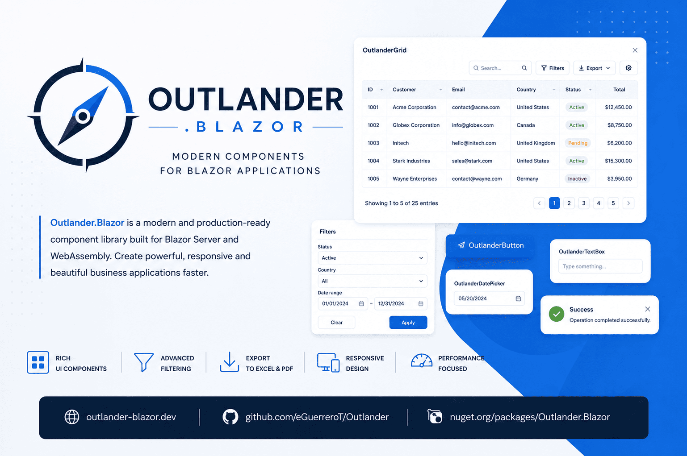

<p align="center">
  
</p>

<h1 align="center">Outlander.Blazor</h1>

<h2 align="center">
  Build Business Applications Faster with Blazor
</h2>

<p align="center">
  <a href="https://www.nuget.org/packages/Outlander.Blazor">
    
  </a>
  <a href="https://www.nuget.org/packages/Outlander.Blazor">
    
  </a>
  <a href="https://github.com/eGuerreroT/Outlander/blob/master/LICENSE">
    
  </a>
</p>

Outlander.Blazor provides a complete application shell, including responsive navigation, 
top bars, theme management and enterprise-ready data components, 
allowing developers to build modern business applications with minimal setup.

The project provides reusable UI components designed to simplify the
development of business applications such as:

-   ERP systems
-   CRM platforms
-   POS applications
-   Reporting systems
-   Dashboards
-   Internal management platforms

------------------------------------------------------------------------

# Features

## Data Components

## OutlanderGrid

A powerful data grid component designed for enterprise applications.

Features:

-   Server-side and client-side data binding
-   Sorting
-   Filtering
-   Global search
-   Row selection
-   Column customization
-   Footer summaries
-   Excel export
-   PDF export
-   Responsive design
-   Bootstrap 5.3 integration
-   Dark theme support
-   Blazor Server support
-   Blazor WebAssembly support

Documentation: [OutlanderGrid](Outlander.Blazor/Docs/Components/OutlanderGrid.md)

------------------------------------------------------------------------

## Layout Components

## OutlanderNavMenu

Responsive navigation component for application layouts.

Features:

-   Desktop collapsed mode
-   Mobile navigation
-   Nested menu items
-   Flyout submenus
-   Footer menu items
-   Persistent collapsed state
-   Bootstrap Icons integration

Documentation: [OutlanderNavMenu](Outlander.Blazor/Docs/Components/OutlanderNavMenu.md)

------------------------------------------------------------------------

## OutlanderTopMenu

Application top navigation component.

Features:

-   Navigation menu toggle
-   Custom left and right content
-   Action buttons
-   Notification badges
-   Theme selector integration
-   Mobile offcanvas actions

Documentation: [OutlanderTopMenu](Outlander.Blazor/Docs/Components/OutlanderTopMenu.md)

------------------------------------------------------------------------

## OutlanderThemeSelector

Bootstrap theme selector component.

Features:

-   Light theme
-   Dark theme
-   System preference
-   Browser persistence using localStorage
-   Bootstrap 5.3 dark mode support

Documentation: [OutlanderThemeSelector](Outlander.Blazor/Docs/Components/OutlanderThemeSelector.md)

------------------------------------------------------------------------

# Installation

Install the NuGet package:

``` bash
dotnet add package Outlander.Blazor
```

------------------------------------------------------------------------

# Quick Start

Add the required namespaces to `_Imports.razor`:

``` razor
@using Outlander.Blazor
@using Outlander.Blazor.Components
@using Outlander.Blazor.Components.Layout
@using Outlander.Blazor.Components.Inputs
```

Add the Outlander stylesheet:

``` html
<link href="@Assets["_content/Outlander.Blazor/css/Outlander.Blazor.styles.css"]" rel="stylesheet" />
```

Add Outlander suport themes script:

``` html
<script src="@Assets["_content/Outlander.Blazor/js/OutlanderTheme.js"]"></script>
```

Add Bootstrap Bundle 5.3 or later:

``` html
<script src="@Assets["lib/bootstrap/dist/js/bootstrap.bundle.min.js"]"></script>
```

Optional Service Registration

```csharp
builder.Services.AddOutlander();
```

For detailed installation instructions:

[Getting Started](Outlander.Blazor/Docs/GettingStarted.md)

------------------------------------------------------------------------

# Documentation

## Components

-   [OutlanderGrid](Outlander.Blazor/Docs/Components/OutlanderGrid.md)
-   [OutlanderNavMenu](Outlander.Blazor/Docs/Components/OutlanderNavMenu.md)
-   [OutlanderTopMenu](Outlander.Blazor/Docs/Components/OutlanderTopMenu.md)
-   [OutlanderThemeSelector](Outlander.Blazor/Docs/Components/OutlanderThemeSelector.md)
-   OutlanderTagsMultiSelect

## Guides

-   [Getting Started](Outlander.Blazor/Docs/GettingStarted.md)
-   [Themes](Outlander.Blazor/Docs/Themes.md)
-   [Layout](Outlander.Blazor/Docs/Layout.md)

------------------------------------------------------------------------

# Roadmap

## Version 0.x

-   [x] OutlanderGrid
-   [x] Excel Export
-   [x] PDF Export
-   [x] Search
-   [x] Filtering
-   [x] Selection
-   [x] OutlanderNavMenu
-   [x] OutlanderTopMenu
-   [x] Theme support
-   [ ] Virtualization
-   [ ] Column Reordering
-   [ ] State Persistence

## Version 1.x

-   [ ] OutlanderButton
-   [ ] OutlanderDialog
-   [ ] OutlanderToast
-   [ ] OutlanderTextBox
-   [ ] OutlanderSelect
-   [ ] OutlanderDatePicker
-   [ ] OutlanderTabs

------------------------------------------------------------------------

# Browser Support

Outlander.Blazor supports all modern browsers:

-   Microsoft Edge
-   Google Chrome
-   Mozilla Firefox
-   Safari

------------------------------------------------------------------------

## Compatibility

| Framework | Supported |
|-----------|-----------|
| .NET 8 | ✅ |
| .NET 9 | ✅ |
| .NET 10 | ✅ |

------------------------------------------------------------------------

## Contributing

Contributions, bug reports, feature requests, and suggestions are welcome.

Please open an issue or submit a pull request.

------------------------------------------------------------------------

## License

MIT License